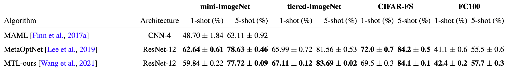
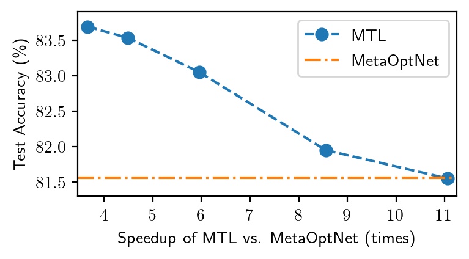

# Bridging Multi-Task Learning and Meta-Learning
Code for the ICML 2021 paper "**Bridging Multi-Task Learning and Meta-Learning: Towards Efficient Training and Effective Adaptation**" by Haoxiang Wang, Han Zhao, and Bo Li from UIUC. [[arXiv:2106.09017](https://arxiv.org/abs/2106.09017)]

This repo contains our efficient implementation of multi-task learning (MTL) for few-shot learning benchmarks. Our empirical studies show that our efficient MTL implementation can match the state-of-the-art gradient-based meta-learning algorithms, while enjoying an order of magnitude less training time. 

If you find this repo useful for your research, please consider citing our paper

```
@inproceedings{wang2021bridging,
  title={Bridging Multi-Task Learning and Meta-Learning: Towards Efficient Training and Effective Adaptation},
  author={Wang, Haoxiang and Zhao, Han and Li, Bo},
  booktitle={International Conference on Machine Learning},
  year={2021},
  organization={PMLR}
}
```

## Installation

This repo was tested with Ubuntu 18.04, Python 3.7 & 3.8 ([Anaconda](https://www.anaconda.com/products/individual) version), Pytorch 1.8 with CUDA 10 & 11. 

**Required Packages**

+ Common Packages (covered by [Anaconda](https://www.anaconda.com/products/individual)): numpy, scikit-learn, tqdm, etc.
+ Pytorch packages: pytorch, torchvision, [pytorch-lightning](https://github.com/PyTorchLightning/pytorch-lightning) (a PyTorch wrapper), [pytorch-optimizer](https://github.com/jettify/pytorch-optimizer) (a collection of optimizers for Pytorch) 
+ Other packages:  [learn2learn](https://github.com/learnables/learn2learn/) (a meta-learning codebase), [WandB](https://github.com/wandb/client) (a smart logger to visualize and track machine learning experiments)

**Installation Tutorial**:

1. Install the Conda package manager with Anaconda following this [webpage](https://www.anaconda.com/products/individual). 

2. In the Conda environment, install PyTorch and TorchVision following the official [tutorial](https://pytorch.org/get-started/locally/).

3. In the Conda environment, install all other packages using the command line

   ```
   pip install pytorch-lightning==1.0.2 torch_optimizer wandb 
   ```
   + Currently, `learn2learn` is not compatible with the latest version of `pytorch-lightning`.
   
4. Install the latest version of `learn2learn` by downloading its GitHub repo to a local folder 

   ```
   git clone https://github.com/learnables/learn2learn.git && cd learn2learn && pip install -e .
   ```

## Code

This repo is mainly built upon the `learn2learn` package (especially its `pytorch-lightning` version).

+ `train.py`: The script to train multi-task learning (and other meta-learning algorithms) on few-shot image classification benchmarks. This code is built upon this [example](https://github.com/learnables/learn2learn/blob/master/examples/vision/lightning/main.py) provided by `learn2learn`.
+ `lightning_episodic_module.py`: This contains a base class `LightningEpisodicModule` for meta-learning. Notice that this class is built upon this [implementation](https://github.com/learnables/learn2learn/blob/master/learn2learn/algorithms/lightning/lightning_episodic_module.py) in `learn2learn`, and we add more choices of test methods, optimizers, and learning rate schedulers to this class.
+ `lightning_mtl.py`: This contains a class `LightningMTL`, which is our implementation of multi-task learning (MTL). Notice that this is a child class of `LightningEpisodicModule`, and it only includes the training code. Please refer to `lightning_episodic_module.py` for the optimizer setup and the test/validation evaluation code (e.g., fine-tuning the last layer by [L2-regularized logistic regression](https://scikit-learn.org/stable/modules/generated/sklearn.linear_model.LogisticRegression.html))
+ `models/`: This folder is adopted from the repo [RFS](https://github.com/WangYueFt/rfs/) by [Yue Wang](https://people.csail.mit.edu/yuewang/), and it contains the implementation of multiple variants of ResNet. For a fair comparison with previous few-shot learning works, we conducted all experiments with the ResNet-12 architecture. However, one can try other architectures (e.g., ResNet-50 or WideResNet-28) to obtain possibly better performance.
+ `datasets/`: This is adapted from this `learn2learn` [folder](https://github.com/learnables/learn2learn/tree/master/learn2learn/vision/datasets), which contains data loaders for few-shot image classification datasets. We only made a slight modification to two data loaders (mini-ImageNet and tiered-ImageNet), so we only present them here. Other data-loaders can be directly loaded from the `learn2learn` package.
+ `benchmarks/`: This is adapted from this `learn2learn` [folder](https://github.com/learnables/learn2learn/tree/master/learn2learn/vision/benchmarks), which provides wrappers for data loaders (e.g., few-shot task construction, data augmentation). We implemented the data augmentation introduced in [MetaOptNet](https://github.com/kjunelee/MetaOptNet/) (named as `Lee19` in our code), and added some functions to accommodate the training of multi-task learning.

## Logging and Checkpointing

+ **Logging**: We use the [WandB](https://wandb.ai/) logger, which can automatically upload all training and evaluation logs to the cloud. You need to register a free WandB account first and log in to it on your workstation/server following this [tutorial](https://github.com/wandb/client). You can also [turn off](https://docs.wandb.ai/guides/technical-faq#what-does-this-do-to-my-training-process) the sync function to make the logger purely offline. Notice that the logger we used is wrapped by Pytorch-Lightning (see this [doc](https://pytorch-lightning.readthedocs.io/en/stable/api/pytorch_lightning.loggers.wandb.html)), and you can easily switch it to other loggers supported by Pytorch-Lighting (e.g., TensorBoard, MLflow, Comet, Neptune), since the logging functions we use in this repo is universal to all Pytorch-Lightning loggers. See this [tutorial](https://pytorch-lightning.readthedocs.io/en/stable/extensions/logging.html) for details.
+ **Checkpointing**: We adopt the [checkpointing functions](https://pytorch-lightning.readthedocs.io/en/stable/common/weights_loading.html) provided by Pytorch-Lightning, which can automatically save checkpoints at the end of every epoch. Our implementation only saves the best epoch checkpoint (i.e., the epoch with the highest validation accuracy) and the last epoch checkpoint, so the disk usage of checkpoints is constant. Pytorch-Lightning can also help you [load checkpoints](https://pytorch-lightning.readthedocs.io/en/stable/common/weights_loading.html) easily.

## Args and Flags

Below, we introduce multiple arguments and flags you might want to modify.

Notice that the argparser does not only parse the arguments in `train.py`. In addition, it also parses arguments in `'lightning_episodic_module.py'` and  `lightning_mtl.py`. Furthermore, some arguments are embedded in `pytorch-lightning` (e.g., `--max_epochs`).

+ `--dataset`: Currently, we support four datasets, `['mini-imagenet', 'tiered-imagenet', 'cifarfs', 'fc100']`
+ `--algorithm`: We only provide the implementation of multi-task learning in this repo. However, you can also try other meta-learning algorithms provided by this learn2learn [folder](https://github.com/learnables/learn2learn/tree/master/learn2learn/algorithms/lightning). 
  + Note: in the empirical comparison of our paper, we take the officially reported performance in the original papers of these meta-learning methods (e.g., MAML, MetaOptNet), instead of running this script with the learn2learn implementation.
+ `--root`: The root directory that saves datasets. The default is `~/data`.
+ `--log_dir`: The directory that saves logs and checkpoints. The defult is `~/wandb_logs`
+ `--gpu`: The index of the GPU you want to use. Currently, our code only supports single-GPU training. 
+ `--norm_train_features`: Normalize features (i.e., last hidden layer outputs) during training. We find this is useful for all datasets except for FC100.
+ `--test_method`: The default is `l2`, which is the [L2-regularized logistic regression](https://scikit-learn.org/stable/modules/generated/sklearn.linear_model.LogisticRegression.html) we use for the fine-tuning adaptation during the test phase. 
+ `--optim`: The optimizer to use (default is `'radam'`, i.e., [RAdam](https://openreview.net/forum?id=rkgz2aEKDr)). The choice list is `['sgd', 'sgdp', 'sgdw', 'adam', 'adamw', 'adamax', 'radam', 'adabound', 'adamp']`. These optimizers are adopted from PyTorch and [pytorch-optimizer](https://github.com/jettify/pytorch-optimizer).
+ `--scheduler`: The learning rate scheduler to use (default is `'plateau'`, i.e., [ReduceLROnPlateau](https://pytorch.org/docs/stable/generated/torch.optim.lr_scheduler.ReduceLROnPlateau.html)). The other choice is `'step'`, which is the [StepLR](https://pytorch.org/docs/stable/optim.html) scheduler.
+ `--meta_batch_size`: The number of training tasks in a batch during (meta-)training.
+ `--train_queries`: 
+ `--test_shots`: The number of shots during the test.
  + We only consider 5-way classification in our experiments. If you want to vary it, you can change the flags `--train_ways` and `--test_ways`.
  + Our implementation of multi-task learning does not care about the number of shots during training, since it does not split a task into query and support data. Thus `--train_shots` is noneffective for multi-task learning. But it is useful to other meta-learning algorithms.
+ `--test_queries`: The number of query samples per class in each test task (default is 30). 
  + In our experiments, we adopt `test_queries = 50`. But this has a large GPU memory consumption, e.g., it will exceed 11GB (the limit of 1080ti and 2080ti) when running on mini-ImageNet. Thus, we set it as `30` here instead. In principle, larger `test_queries` leads to a more accurate estimation of the test accuracy. However, if you cannot use a large value of `test_queries`, you can also enlarge the following `final_test_epoch_length` to obtain a more accurate test accuracy estimation.
+ `--final_test_epoch_length`: The number of tasks for test evaluation at the end of training. Default is 2000. 
+ `--no_log`: Running the script with this flag will turn off the logging and checkpointing. Notice that in this mode, pytorch-lightning will automatically write some checkpoint files to `./checkpoints/`.
+ `--max_epochs`: the number of maximum training epochs.


## Running

To replicate empirical results of multi-task learning shown in the paper, please run the following commands with your preferred root directory to save datasets and the GPU to use. The code can automatically download datasets to the root directory you specified.

In the following demo, we consider the root directory as `/data` and the GPU index as `0`.

### mini-ImageNet 

+ 5-shot

  ```
  python train.py --gpu 0 --root ~/data --norm_train_features --meta_batch_size 2 --test_shots 5 --algorithm mtl --dataset mini-imagenet
  ```

+ 1-shot

  ```
  python train.py --gpu 0 --root ~/data --norm_train_features  --test_shots 1 --algorithm mtl --dataset mini-imagenet
  ```

###  tiered-ImageNet

+ 5-shot

  ```
  python train.py --gpu 0 --root ~/data --norm_train_features --train_queries 35 --meta_batch_size 1 --test_shots 5 --algorithm mtl --dataset tiered-imagenet
  ```

  + For multi-task learning, there is no query-support split during training (i.e., one can think that we "merge" query and support data for multi-task learning). Then, given the default `train_queries = 5`,  setting `--train_queries 35` makes the number of samples per class in each training task to be `40`. 

+ 1-shot

  ```
  python train.py --gpu 0 --root ~/data --norm_train_features --train_queries 35 --meta_batch_size 2 --test_shots 1 --algorithm mtl --dataset tiered-imagenet
  ```

  

### CIFAR-FS

+ 5-shot

  ```
  python train.py --gpu 0 --root ~/data --norm_train_features --test_shots 5 --algorithm mtl --dataset cifarfs
  ```

  

+ 1-shot

  ```
  python train.py --gpu 0 --root ~/data --norm_train_features --train_queries 15 --meta_batch_size 2 --test_shots 1 --algorithm mtl --dataset cifarfs
  ```

  

### FC100

+ 5-shot

  ```
  python train.py --gpu 0 --root ~/data --test_shots 5 --algorithm mtl --dataset fc100
  ```

  

+ 1-shot

  ```
  python train.py --gpu 0 --root ~/data --train_queries 4 --train_shots 1 --meta_batch_size 1 --test_shots 1 --algorithm mtl --dataset fc100
  ```

  + Setting `--train_queries 4 --train_shots 1` reduces the number of samples per class in each training task to be `4+1=5` for multi-task learning, since it does not have the query-support splitting.

## Results

Here is an empirical comparison of our implementation of multi-task learning against MetaOptNet, a state-of-the-art gradient-based meta-learning algorithm. For more results, please refer to our paper.




## Efficiency comparison

We benchmarked the training cost of Multi-Task Learning and [MetaOptNet](https://github.com/kjunelee/MetaOptNet/) on [AWS-EC2 P3 instances](https://aws.amazon.com/ec2/instance-types/p3/). See our papers for more details.

+ **mini-ImageNet** (5-way 5-shot)

|                     | Test Accuracy | GPU Hours |
| :------------------ | ------------- | --------- |
| MetaOptNet          | 78.63%        | 85.6 hrs  |
| Multi-Task Learning | 77.72%        | 3.7 hrs   |


+ **tiered-ImageNet** (5-way 5-shot)

  

	+  We vary the `meta_batch_size` and the number of epochs and finally obtain this plot. Each dot of MTL represents the result of one configuration. With smaller `meta_batch_size` and the number of epochs, MTL can be 11x faster than MetaOptNet while achieving the same performance (81.55% vs. 81.56%).

## Contact Information

Please contact Haoxiang Wang (hwang264@illinois.edu) for any questions regarding this repo.

If you have questions regarding the `learn2learn` codebase, please consider joining the [learn2learn slack](https://github.com/learnables/learn2learn/) to ask the authors and contributors of learn2learn directly.

## Acknowledgments

In this repo, we adopt some code from the following codebases, and we sincerely thank their authors:

+ [learn2learn](https://github.com/learnables/learn2learn/): This repo is built on the learn2learn codebase (more precisely, the [pytorch-lightning version of learn2learn](https://github.com/learnables/learn2learn/tree/master/examples/vision/lightning)), and the implemented multi-task learning code will be pushed to learn2learn in the future. Stay tuned!
+ [RFS](https://github.com/WangYueFt/rfs/): We adopt the implementation of neural net architectures (e.g., CNNs, ResNets) from the RFS codebase (i.e., we copied their `models/` to the `'./models'` in this repo).